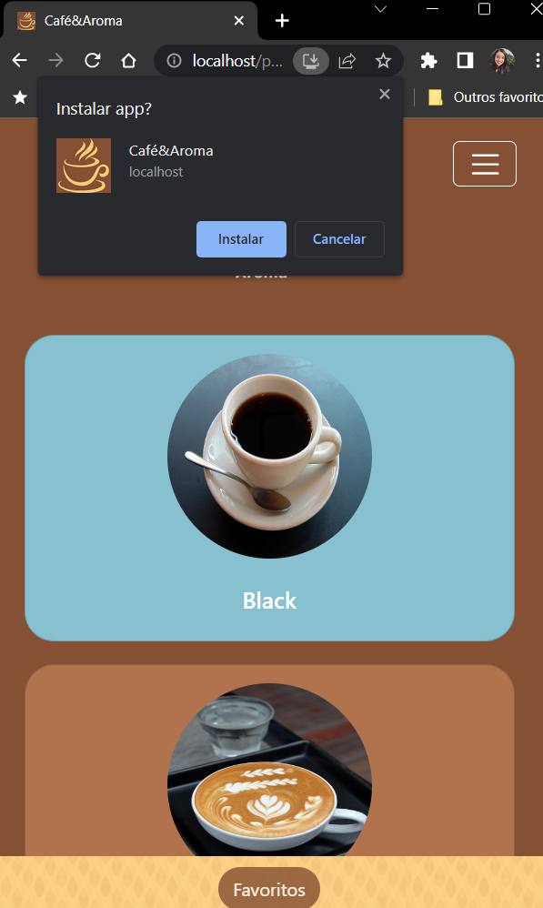
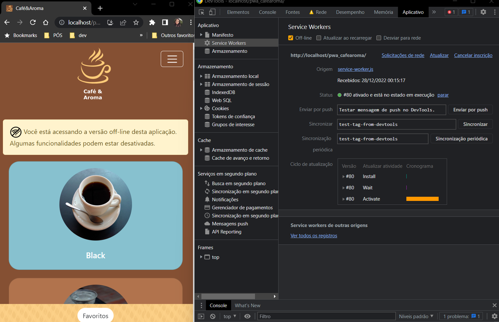
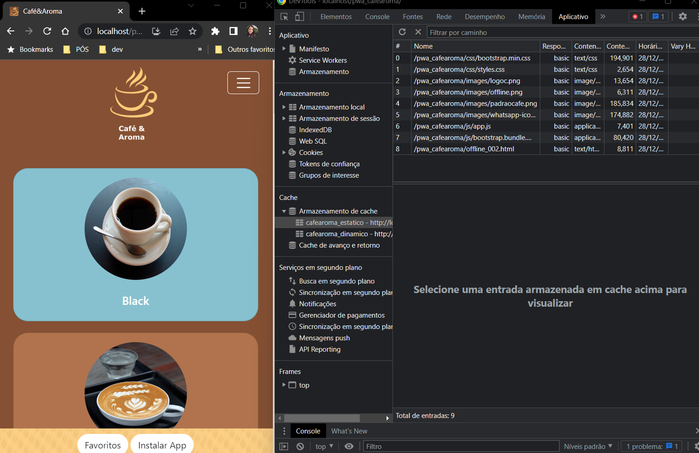

# PWA
Descrição: Construção de um PWA para a disciplina de Arquitetura de Aplicações Móveis da Pós Graduação em Engenharia de Software

- Validação de todos os items necessários a um PWA (exceção do HTTPS porque nem todos tem servidores com ssl);
- manifesto;
- cor do theme;
- ícones completos;
- offline;
- Construção de um cache para armazenamento das Views estáticas;
- Construção de um cache para armazenamento de conteúdo (parte dinâmica da página vinda de um .JSON);

### Instalação do App:
Necessário uma interação com o ACEITAR / Ñ ACEITAR do usuário (ex: somente deixar ele seguir se instalar, ou dar uma mensagem de boas vindas somente após instalação).

## Tecnologias Utilizadas
- VSCODE IDE
- Javascript
- Html
- CSS
- XAMPP

## Execução com XAMPP
1. Download em https://sourceforge.net/projects/xampp/
2. Execução
3. Colocar a pasta do seu projeto dentro da pasta htdocs:
   `` 
   C:\xampp\htdocs\PASTA_DO_PROJETO
   ``
 4. Dar START no Xampp, ir ao navegador e digitar na (URL)
   ``
   localhost/PASTA_DO_PROJETO
   ``

## Aprendizados
- O que é um PWA
- Como funciona e como implementar o Service Worker
- Como criar uma versão offline e cacheada de um site
- Cachear arquivos e estilos do Bootstrap
- Criação de um Manifest
- Uso do XAMPP
- 
## Resultados

